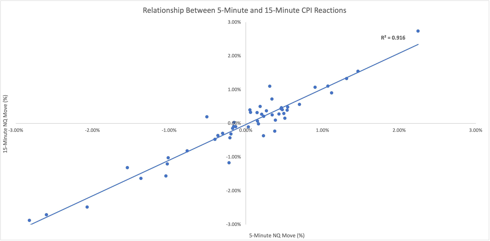
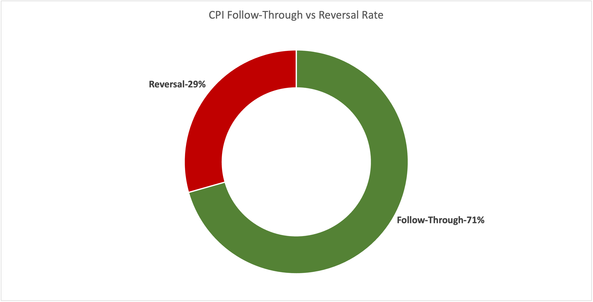
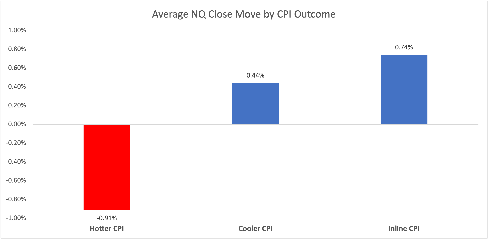
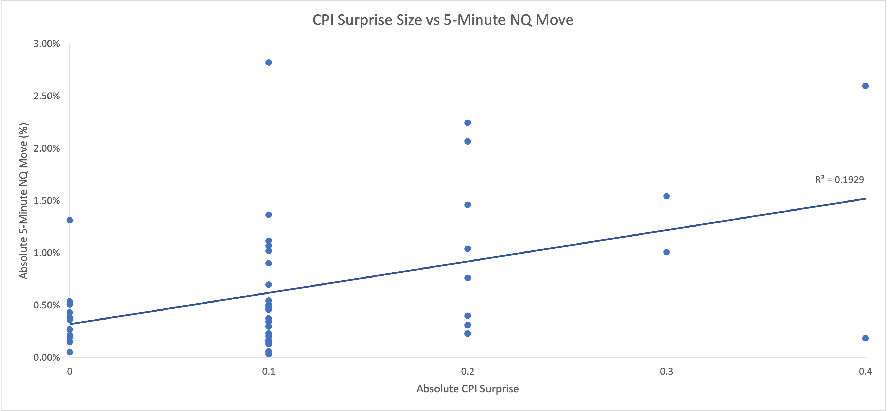

# What 51 CPI Releases Revealed About NQ Futures Reactions

## Project Background

CPI releases are one of the most important macroeconomic events for equity index futures because inflation data can quickly shift expectations around interest rates, Federal Reserve policy, and overall market risk sentiment.

For this project, I analyzed how Nasdaq-100 futures (NQ) reacted to CPI Year-over-Year releases from 2022 through 2026. The goal was to understand whether CPI surprises created consistent patterns in immediate reactions, intraday continuation, reversals, and end-of-day direction.

## Why This Analysis Matters

Rather than only looking at whether CPI was hotter or cooler than expected, this analysis tests how NQ behaved after the release:

- Did the first 5-minute reaction predict the close?
- Did hotter CPI usually lead to bearish closes?
- Did larger CPI surprises create larger moves?
- Did reactions continue or reverse after the initial move?

The findings show that CPI reactions were not random. In many cases, the initial move contained meaningful information about the rest of the session.

## Data & Methodology

The dataset includes 51 CPI release events from 2022 through 2026. CPI data was collected using CPI Year-over-Year actual and forecast values, and NQ futures reaction data was collected using intraday TradingView candles.

CPI surprise was calculated as:

Actual CPI - Forecast CPI

Price reaction windows included:

- 5-minute reaction
- 15-minute reaction
- End-of-day close reaction

The analysis measured direction, percentage moves, reversal behavior, follow-through rates, and correlations between CPI surprise size and NQ move size.

## Analysis & Findings
### Initial Reaction vs End-of-Day Direction

The initial 5-minute CPI reaction matched the end-of-day direction 70.59% of the time. This suggests that the first reaction often contained useful directional information about the rest of the trading session.
### CPI Surprise Direction

Hotter-than-expected CPI releases led to red closes 76.47% of the time, while cooler-than-expected CPI releases led to green closes 66.67% of the time.

This shows that NQ futures tended to react negatively to hotter inflation surprises and positively to cooler inflation surprises.
### Reversal vs Follow-Through Behavior

About 29.41% of CPI days reversed direction after the initial reaction, while 70.59% followed through in the same direction.
### Average Move by CPI Outcome

Hotter CPI releases produced an average close move of -0.91%, while cooler CPI releases produced an average close move of +0.44%. Inline CPI releases produced a stronger average close move of +0.74%.
### CPI Surprise Size vs 5-Minute Move Size

Larger CPI surprises were moderately associated with larger immediate NQ reactions, with a correlation of 0.44.
### 5-Minute vs 15-Minute Reaction

The 5-minute and 15-minute CPI reactions had a correlation of 0.96, showing extremely strong short-term continuation after the initial move.
## Final Takeaways

This analysis found that CPI releases had a meaningful impact on NQ futures behavior. Hotter-than-expected CPI releases were strongly associated with bearish closes, while cooler CPI releases were more likely to produce bullish closes.

The most important finding was that the initial 5-minute reaction often carried meaningful information. It matched the end-of-day direction about 71% of the time and had a very strong relationship with the 15-minute reaction.
## Connect With Me

This project is part of my data analytics portfolio, focused on financial markets, macroeconomic events, and data-driven market behavior.

Feel free to connect with me on LinkedIn or view my other projects on GitHub.
